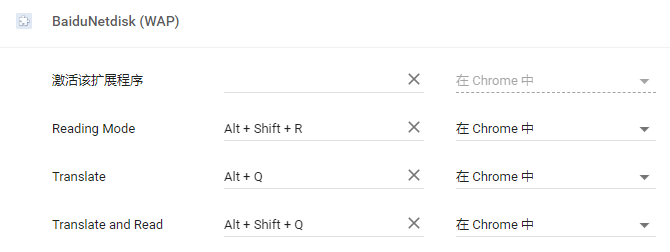

# BaiduNetdisk (WAP)

<details>
<summary>Table of Contents</summary>

- [Install](#install)
- [Features](#features)
  - 禁止跳转至 PC 版网页
  - 突破大文件限制
- [Extra](#extra)
  - 优酷视频使用 HTML5 播放器
  - 腾讯视频使用 HTML5 播放器
  - 伪装指定网站的 User-Agent
  - 加载自定义 CSS
  - 阅读模式
  - 翻译文本
  - 移除重复标签页
  - 播放原生 HLS (m3u8) 视频
- [Note](#note)

</details>

## Install
Chrome: 更多工具 -> 扩展程序 -> 开发者模式 -> 加载已解压的扩展程序 -> 导航至文件夹 Chrome，点击确定。

## Features

### 禁止跳转至 PC 版网页
https://pan.baidu.com/wap/home

### 突破大文件限制
https://pan.baidu.com/disk/home

## Extra

### 优酷视频使用 HTML5 播放器（解除优酷对 PC 端访问移动端的操作限制）
* http://m.youku.com/video/id_XMTg4MDUzNDM5Mg==.html
* http://m.youku.com/video/id_XMTQ1NzQ4MTg3Ng==.html

### 腾讯视频使用 HTML5 播放器
* https://v.qq.com/x/cover/vtxb95np45a6ooz/j0022b6o28p.html

### 伪装指定网站的 User-Agent (Android)

#### Header

1. 在 `background.js` 中指定网站。
  ```javascript
  urls: ['*://*.v2ex.com/*', '*://*.zhihu.com/*', '*://v.youku.com/*']
  ```

2. Done.

#### Native

1. 在 `manifest.json` 中指定网站。
  ```javascript
  "js": ["user_agent_native.js"],
  "matches": ["*://*.baidu.com/*", "*://v.youku.com/*"],
  ```

2. Done.

### 加载自定义 CSS

在 `main.css` 中添加样式。

```css
a{text-decoration:none !important}
a:hover { text-decoration: underline !important;}
*:not([class*="icon"]):not(i){font-family: "Microsoft YaHei","Symbol" !important;}
```

### 阅读模式

开启 | 关闭：<kbd>Alt</kbd>+<kbd>Shift</kbd>+<kbd>R</kbd>

#### 指定网站自动开启阅读模式

在 `manifest.json` 中指定网站。

```javascript
"js": ["autoplay_read.js"],
"matches": ["*://*.jianshu.com/*", "*://*.wikipedia.org/*", "*://*.stackoverflow.com/*"],
```

### 翻译文本

翻译 **选中** 文本并将结果输出至 F12 Console。

* 翻译&#8195;&#8195;&#8195;&#8196;：<kbd>Alt</kbd>+<kbd>Q</kbd>
* 翻译 + 朗读：<kbd>Alt</kbd>+<kbd>Shift</kbd>+<kbd>Q</kbd>

### 移除重复标签页

### 播放原生 HLS (m3u8) 视频
* https://d2zihajmogu5jn.cloudfront.net/bipbop-advanced/bipbop_16x9_variant.m3u8

## Note

因为安全原因，高版本的 Chrome 可能需要 **自己设置快捷键**。


